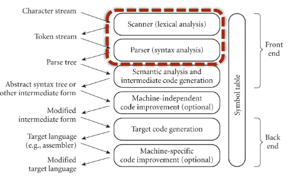
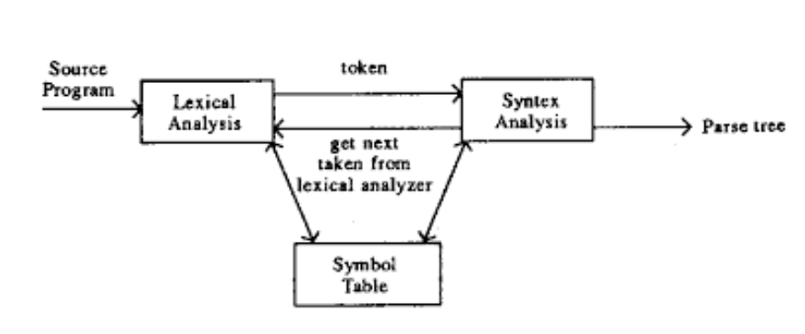
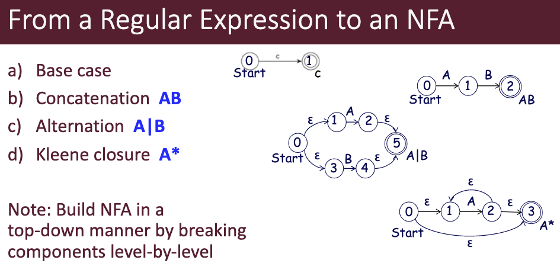
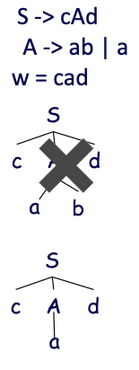
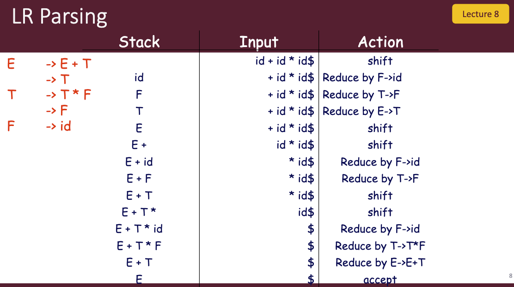

# [Textbook Link](http://www.djnutte.com/pdf/Fall%202020%20Concepts%20of%20Programming%20Languages%2012th%20Edition%20.pdf)

# What is a language?

## Syntax

Describe what a program **looks** like. 

Specified using **regular expressions** and **context-free grammars**

## Semantics

Describes what a program **means**.

Specified using *axiomatic, operational or denotational* semantics.

## Regular Expressions

A unified representation for a set of strings. Constructed with

- `a` A character
- `ε` The empty string denoted
- `.` Concatenation 
  - a.B => aB
- `|` "Or" 
  - A|B => "A", "B"
- `*` Kleene star (zero or more)
  - B* => "", "B", "BB", "BBB", ....
- `+` one or more
  - c+ => "c", "cc", "ccc", ...
- `[]` selects any char
  - [abc] => "a", "b", "c"
- `[]+` subcomoment with 1 or more instance
  - [ab]+ => "a", "b", "aa", "ab", "aba", "ba", ...
- `-` defines a range
  - [0-9] digits
  - [A-Z] uppercase letters

## Lexeme, Token, & Pattern

**Lexeme:** 

A sequence of characters in the source program with the lowest level of syntactic meanings.

**Token:** 

- A category of lexemes
- A lexeme is an instace of a token
- Basic building blocks of programs

**Examples**

Token | Lexeme Example
--- | ---
keyword | `if else`
comparison | `<=, !=, ==`
number | `0`
id | `pi, score d2`

**Pattern:**

- Description of the form of lexemes
- Specified with regular expressions
- Pattern for identifies is `letter(letter|digit|_)*`
  
## Context Free Grammar

Uses **BNF** notation

- **Terminals:** basic symbols which form strings
- **Non-Terminals:** syntaxtic variables to impose the structure
  - Ex: <exp>, <stmt>
- **Start-Symbol:** a *non-terminal* you always start with
- **Production:** Rules for how to replace non-terminals
  - Ex: <if_stmt> -> if <expr> then <stmt> | if <expr> then <stmt> else <stmt>
  
- **Derivation:** Repeatedly applying rules to nonterminals gives us a string only terminals.
- **Sentence:** A string with only terminals
- **Sentinal Form:** A string with terminals and non-terminals
- **Left recursion:** Recursion occurs on the left
  - Ex: E -> E + T | T
- **Right recursion:** Recursion occurs on the right
  - Ex: E -> T | T + E
- **Leftmost derivation:** Derivation using the left-most non-terminal.
  - Creates a *left-sentinal form*
- **Rightmost derivation:** Derivation using the right-most non-terminal.
  - Creates a *right-sentintal form*
- *Note* some derivations are neither left not right

# Big Picture

## Parse Tree

A parse tree is a hierarchal representation of a derivation as a tree.

A grammar is ***ambiguous** if a senintal form has more than 1 unique parse tree.

**Associativity:** group left to right or right to left [Ex: (10 - 4) - 3 vs 10 - (4 - 3)]

**Precedence:** order of operations. Think PEMDAS

Ambiguous grammars don't capture these properties

**EBNF**

Extensions of BNF

- `*` 0 or more
- `()` alternative parts
- `[]` optional parts

## Lexical and Syntactic Analysis

- Lexical Analysis (Scanner) turns characters into tokens
  - Uses regular expressions
  - Reports lexical errors
  - Removes comments and white space
  - Expand macros and implement preprocessor functions
- Syntactic Analysis (Parse) turns tokens into a parse tree
  - Uses the BNF to verify the structure

### DFA/NFA

Each of these is a graph which represents a state machine made of

- A finite set of states (Q)
- A finite set of input symbols (E)
- An initial start state
- A set of accept states
- Transition functions
  - DFA transition functions take a state and input and output **1** state
    - Q x E -> Q
  - NFA transition functions take a state and input and output **Multiple** states
    - Q x E -> P(Q)

### NFA to DFA

Trans(State, input) = States reachable by using the input once or using epsilon as many times

### Minimize DFA

Replace all states with the same transitions

*Note:* 2 states dont have the same transitions if one is a final state and the other is a non final state

## Grammar Classes

- **LL(1)** 
  - L: scans input left to right
  - L: produces a leftmost derivation
  - 1: uses one input symbol of *look ahead*
  - Top down
    - Build parse tree from root
    - Find derivation for string
- **LR:** left-to-right, rightmost derivation
  - L: left to right
  - L: produces a right most derivation *in reverse*
  - 1: one symbol look ahead
  - Bottom up
    - Build parse tree from leaves
    - Reduce string to start symbol

### Recursive Descent Algorithm (LL)

- if there is only one RHS then
  - **for each terminal in the RHS**
    - **compare it with the next input token**
    - **if they match, then continue**
    - else report an error
  - **for each nonterminal in the RHS**
    - **call its corresponding subprogram and try match**
  - if no success report error
- else// there is more than one RHS
  - **choose the RHS based on the next input token (the lookahead)**
  - **for each chosen RHS**
    - **call the corresponding subprogram and try match**
  - if no success report error
- if matches not found report error

Notes:

- O(n^3)
- May require back tracking
- LL(1) does not allow back tracking
  - By applying the look ahead we can decide which one to apply
  - Reduces time complexity to O(n)

Non-LL grammars can be converted to LL(1) via

- left recursion elimination
- left factoring by extracting common prefixes
- *Note* this is necessary but **insufficient**
  - Define a "disambiguating rule"

### Bottom up parsing (LR)

Scan the string to look for a substring that matches the right side of some production

Two operations
- Shift: put token on to stack
- Reduce: apply rule to elements in stack

